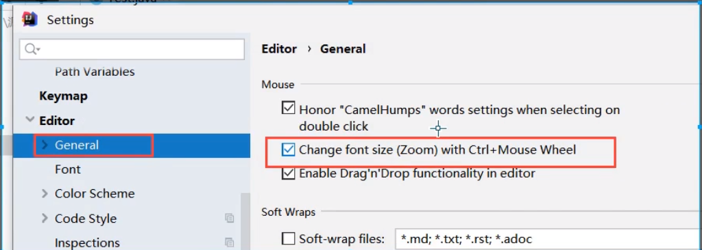

# 1.创建项目

1. 选择创建项目

2. 选择java项目(根据实际情况选择)

3. 创建空项目

4. 填入项目名称和存放目录位置

注意这里的projectname实际指的是一个整体工作空间的名称，在这个project下边可以存在很多个子项目，在idea中成为module

# 2.设置

## 鼠标滚轮控制字体大小

## 自动导包和优化

## 导包超过限额就变为.*

## 忽略大小写导入的代码提示

## 默认添加序列化版本号

## 导入jar包

file->project structure->libaries=>+

## 配置代码模板

> 在 postfixCompletion当中可以配置后缀触发的模板，而在LiveTemplate中配置的是直接根据关键词触发的模板

填充变量的时候可以使用的函数参考https://www.jetbrains.com/help/idea/template-variables.html#pdtv

## 允许程序并行执行

# 3.使用maven

## 3.1创建Maven项目

## 3.2导包

https://mvnrepository.com/

这个网站可以搜索需要的gav

## 异常处理

如果运行的时候报累找不到，首先查看配置文件的module是否正确

如果配置正确，则使用maven clean清除之后maven compile重新编译项目

