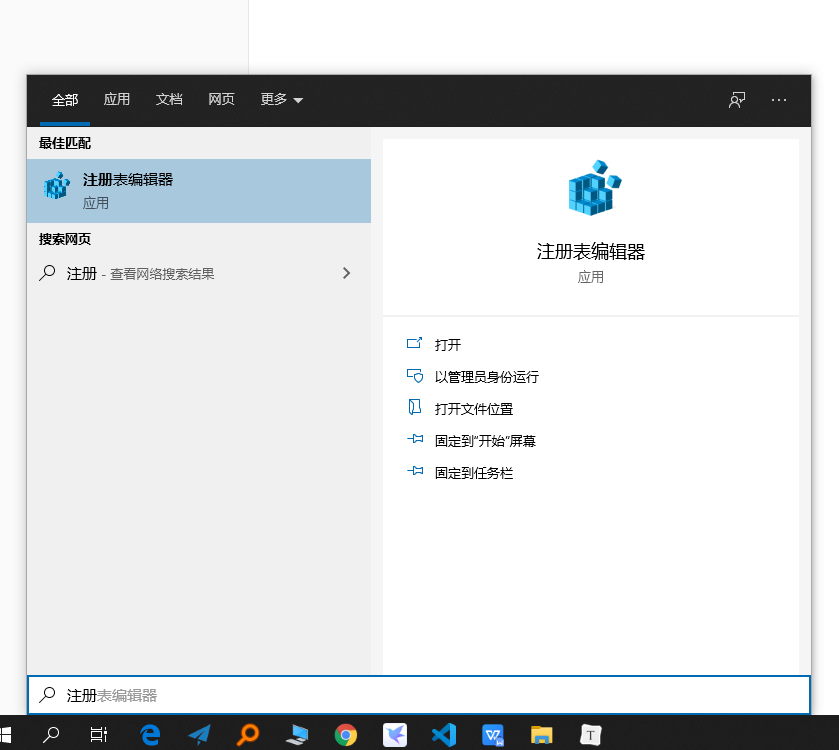
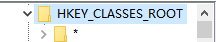
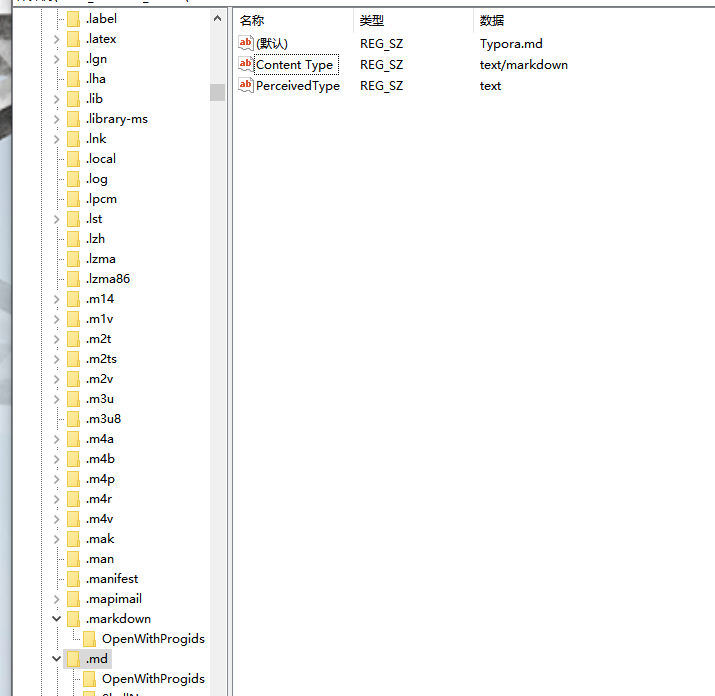
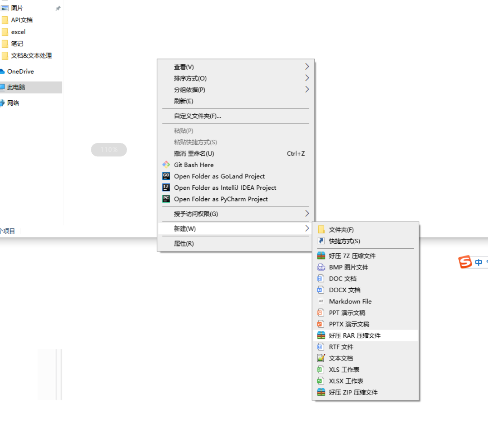

## 1.windows下添加右键新建md文件选项

1.打开注册表



2.找到HKEY_CLASSES_ROOT



3.设置值如下



4.查看右键菜单



> 第二种方法是新建txt文件，文件内容如下，然后改名为reg文件执行即可
>

```
Windows Registry Editor Version 5.00

[HKEY_CLASSES_ROOT\.md]
@="Typora.md"
"Content Type"="text/markdown"
"PerceivedType"="text"

[HKEY_CLASSES_ROOT\.md\ShellNew]
"NullFile"=""
```

